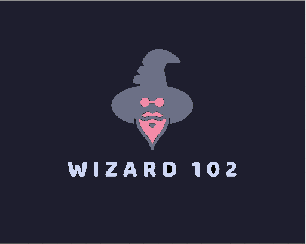
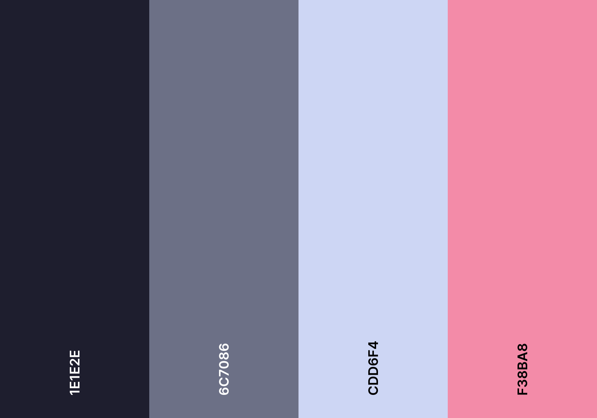

    
  
  # **Wizard 102**

  #### Wizard 102 is currently a 1 vs. 1 arena where you and your enemy get to choose from 4 different elements and fight eachother. Each element has a different specialty such as more health, freezing abilities, more damage, or extra charge. May whoever wins be the superior wizard.
  

  COLOR PALETTE            |  DEMO
:-------------------------:|:-------------------------:
   |  <video width=100% controls><source src="wiz-102-demo.mp4" type="video/mp4">DEMO Video</video>

## **KEY FEATURES:**
The program Wizard 102 was inspired behind the game Wizard 101. Wizard 102 is a 1v1 wizard arena game where you and your friend/enemy get to hash it out with magical spells. Each mage type has a different ability or strength that makes them have their own strength
## **HOW TO USE (Visual Studio Code)**
1. You 2 users names.
2. If you want to see ability descriptions you can check each mage type ability
3. Afterwards it rolls a dice to determine who attacks first
4. Throughout the course of the game you build up charge and certain abilities can take more charge.
5. Damage is multiplied by dice rolls when you say fight and choose your ability.